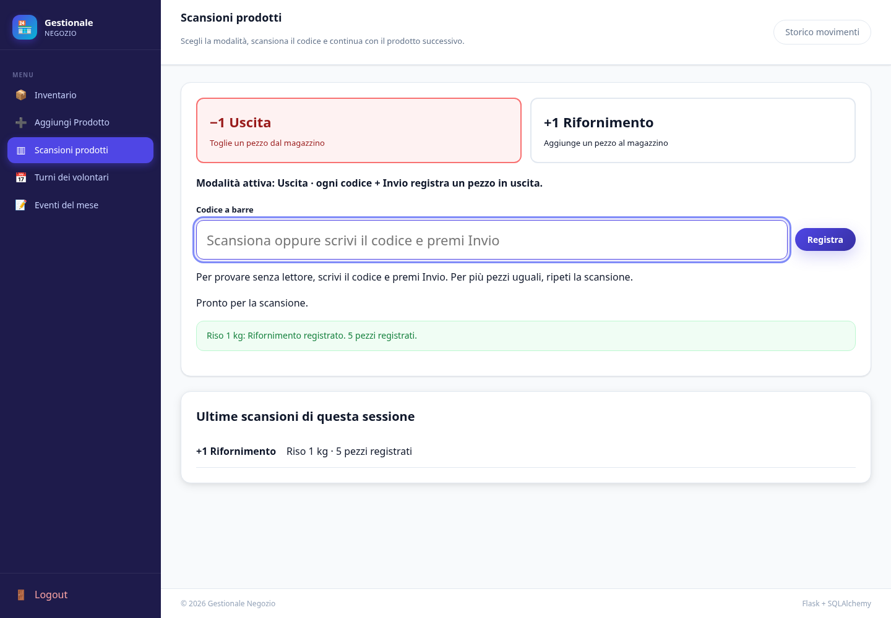

# Gestionale negozio

Applicazione Flask in italiano per inventario prodotti, turni dei volontari ed eventi.
Il progetto importato da `progetto negozio.zip` è indipendente dall’archivio del gestionale film.

## Avvio in sviluppo

Python 3.12 è la versione verificata nell’ambiente cloud. La dipendenza `tzdata`
fornisce i fusi orari anche su Windows, dove non è presente il database IANA di sistema.
Dalla cartella del progetto:

```sh
python -m venv .venv
# Linux/macOS:
source .venv/bin/activate
# Windows PowerShell: .venv\Scripts\Activate.ps1
python -m pip install -r requirements.txt
python -m flask --app run init-db
python -m flask --app run create-admin
python -m flask --app run run --debug
```

`create-admin` chiede username e password (almeno 8 caratteri) senza mostrarla.
L’account amministratore è l’account del capo; tutte le pagine operative richiedono accesso.
La creazione del primo amministratore via `/admin` è disabilitata: usare il comando dalla macchina fidata.
I volontari sono un’anagrafica, senza account o password.

Senza variabili database si usa SQLite in `instance/negozio.sqlite`. Questa cartella,
la chiave di sessione locale e `.env` sono esclusi da Git. La chiave locale viene generata
una sola volta, con permessi riservati, così le sessioni restano valide dopo il riavvio.
La modalità sviluppo è il valore predefinito; per produzione impostare esplicitamente `APP_ENV=production`.

## Scansioni prodotti: uscita e rifornimento



Apri **Scansioni prodotti**. La modalità iniziale è **Uscita**.
Ogni codice seguito da Invio registra un movimento di **un pezzo**:

- **Uscita −1** diminuisce la quantità; il prodotto resta nell’inventario anche a zero.
- **Rifornimento +1** aumenta la quantità. La modalità selezionata è evidenziata.
- Puoi usare un lettore USB in modalità tastiera con suffisso Invio, oppure scrivere il codice
  con la tastiera per provare senza hardware. Il NetumScan NSL5 non è stato provato fisicamente.
  Verifica nel manuale USB HID e suffisso Enter; evita letture automatiche ripetute dello stesso
  pezzo tenuto fermo davanti al sensore. Ogni lettura completa viene considerata un pezzo distinto.

I codici sono testo: gli zeri iniziali vengono conservati. Si accettano codici di massimo
128 caratteri ASCII senza spazi o controlli; una scansione non è interpretata come un URL
né apre collegamenti. Ogni codice corrisponde a un prodotto, con un codice per scheda.
Puoi inserirlo anche da **Aggiungi Prodotto** o **Modifica** e cercarlo nell’inventario.

### Recuperare prodotti mancanti senza bloccare l’uscita

Se il codice è sconosciuto, la pagina mette in pausa la scansione e offre due alternative:

1. **Prodotto già presente:** cercalo per nome/marca, poi scegli **Associa e registra**.
   Il codice viene collegato alla scheda e viene registrato il movimento corrente, insieme.
2. **Prodotto assente:** apri **Non è presente: registra un nuovo prodotto**, inserisci il nome
   e, se la conosci, la quantità presente **prima** della scansione. Conferma con
   **Crea prodotto e registra uscita/rifornimento**. Prezzo, marca e descrizione si possono completare dopo.

Non occorre scansionare ogni pezzo per creare la scheda: se sono 30 confezioni identiche,
puoi indicare 30 come quantità iniziale. La scansione corrente viene applicata dopo: 29 in uscita,
31 in rifornimento. Se la quantità iniziale non è nota, lascia il campo vuoto: il conteggio
registrato parte da zero e viene segnalato **da verificare**, senza inventare le scorte reali.
Una registrazione rapida appare come **Scheda da completare**, con il prezzo **Da completare**.

### Prodotto presente ma quantità registrata zero

Per l’uscita, premi **Il prodotto è presente: registra l’uscita**. Il movimento fisico −1
viene salvato nello storico e la scheda viene marcata **Giacenza da verificare**.
Il conteggio numerico resta zero: non viene cancellato il prodotto, non si inventa
la disponibilità restante e non vengono create giacenze negative.
La segnalazione resta anche dopo successivi rifornimenti. Per risolverla, conta i pezzi,
apri **Modifica**, inserisci la quantità effettiva e spunta **Ho contato i pezzi presenti**.
Completare solo nome/prezzo o registrare un rifornimento non cancella la segnalazione.

Le scansioni consecutive sono accodate; ogni richiesta conserva la modalità scelta quando
è stata letta. Se si interrompe la risposta di rete, usa **Riprova questa scansione**:
lo stesso identificativo impedisce di applicare due volte un movimento già registrato.
Le richieste in attesa sono conservate in `sessionStorage` per la stessa scheda del browser
anche dopo una ricarica; non chiudere la scheda con scansioni pendenti. In caso di pausa,
completa o salta esplicitamente il codice prima di continuare a usare il lettore.

**Storico movimenti** mostra prodotto, codice, operatore, data locale di Roma,
variazione e quantità prima/dopo. Le segnalazioni sono fotografate al momento del movimento;
restano nello storico anche dopo aver verificato la giacenza. Lo storico viene conservato
anche se una scheda prodotto viene eliminata manualmente. Non è un registro fiscale delle vendite.

### Installare l’aggiornamento su un database esistente

Esegui `python -m flask --app run init-db` dopo aver aggiornato `app` e `static`.
Aggiunge `codici_prodotti`, `stati_giacenza` e `movimenti_magazzino`, senza modificare le
colonne della tabella prodotti o azzerare le quantità esistenti. Non attribuisce codici
arbitrari alle schede: inseriscili manualmente o associali al primo passaggio del prodotto.
Conserva e fai il backup della cartella `instance` e dell’eventuale `.env`.

Su PythonAnywhere, conserva la cartella già indicata nel file WSGI e il relativo ambiente
`.venv`. Caricare un nuovo ZIP non aggiorna automaticamente il sito: copia i contenuti
nuovi di `app` e `static` nella cartella configurata, esegui `init-db` nella console Bash
con la `.venv` attiva, quindi premi **Reload** nella scheda **Web**. Conserva account,
database e chiave di sessione in `instance`. Non avviare `flask run` per servire il sito pubblico.

## Turni: due slot per giorno


Dal menu **Turni dei volontari** apri il mese che vuoi organizzare.
Ogni giorno ha esattamente due slot: **Mattina** e **Pomeriggio**.
Non si inseriscono titoli o orari per i turni.

- **Rosso / Libero**: nessun volontario assegnato.
- **Verde / Coperto**: uno o più volontari assegnati; i nomi appaiono nello slot.

Clicca sullo slot, spunta i volontari e premi **Salva assegnazioni**.
Puoi assegnare più persone allo stesso slot e la stessa persona a mattina e pomeriggio.
Per rimuovere tutti i nomi usa **Libera slot**, con conferma. Il riquadro tornerà rosso.
Il numero di slot non cambia e non è possibile creare un terzo turno.
Su telefono ogni giorno mostra i due slot affiancati, senza scorrimento orizzontale.

In **Volontari** puoi aggiungere, rinominare o disattivare un nome.
Un volontario disattivato resta nelle assegnazioni esistenti ma non può essere aggiunto
agli altri slot. Non ha un account di accesso. Sono supportate le date dal 2000 al 2100.

## Eventi del mese

Gli eventi hanno una pagina separata, **Eventi del mese**: seleziona il mese e premi
**Aggiungi evento**. Inserisci cosa succede, giorno, eventuale ultimo giorno, luogo e dettagli.
L’ultimo giorno è incluso; se lo lasci vuoto l’evento dura un solo giorno.
Puoi modificare o eliminare ogni evento. Gli eventi non occupano slot e non cambiano
i colori del calendario dei turni.

## Aggiornare la prima versione su Windows

1. Ferma il sito con **Ctrl+C** e fai una copia della cartella `instance` come backup.
2. Scarica il nuovo ZIP dal ramo `codex/calendario-volontari-20261006`.
3. Copia le cartelle `app` e `static` dalla nuova versione nella cartella già usata,
   sostituendo i file. Puoi aggiornare anche `tests` e `README.md`.
   Conserva `.venv`, `instance` e l’eventuale `.env`: contengono ambiente, account e dati.
4. Nello stesso terminale, con `(.venv)` attivo, esegui:

```bat
python -m flask --app run init-db
python -m flask --app run run --debug
```

`init-db` aggiunge le tabelle degli slot e converte i vecchi turni. Per questa conversione,
le porzioni del vecchio intervallo prima delle 12:00 vengono assegnate alla mattina,
quelle dopo le 12:00 al pomeriggio. Un vecchio turno che attraversa mezzogiorno copre entrambi.
Gli slot nuovi non hanno orari da scegliere: questa regola serve solo a recuperare i dati precedenti.
Controlla le assegnazioni importate e correggile secondo le necessità del negozio.
I vecchi record, con titoli, note e orari, restano nel database e gli eventi restano invariati.
La conversione si esegue una sola volta per ogni vecchio turno: ripetere `init-db`
non ripristina volontari rimossi dagli slot né duplica assegnazioni.
Non occorre ricreare l’account del capo.

## TiDB esistente

Copia `.env.example` in `.env` e compila `DB_HOST`, `DB_PORT`, `DB_USER`, `DB_PASS`,
`DB_NAME` e `DB_SSL_CA`. Non condividere il file né includerlo negli archivi da distribuire.
Usare il certificato CA corretto per il proprio cluster; `certs/tidb-ca.pem` è quello
fornito nell’archivio originale. La connessione verifica certificato e nome del server.
Le password con caratteri speciali vengono gestite senza concatenare stringhe URL.
`DATABASE_URL`, se presente, ha precedenza: non impostarla se vuoi usare le variabili TiDB.

Con backup disponibile, esegui `python -m flask --app run init-db` sul database selezionato:
crea le tabelle mancanti, incluse `turni_slot`, `slot_volontari` e `turni_migrati`,
esegue la conversione dei turni descritta sopra e conserva `admin`, `prodotti` ed eventi. Il comando **non** aggiorna lo schema di tabelle già presenti:
per cambiamenti futuri alle colonne serviranno migrazioni. Il server non crea tabelle
all’avvio e non nasconde gli errori di connessione. Gli errori database nelle richieste
mostrano una pagina 503 senza esporre credenziali.

TiDB non è stato verificato da questo ambiente cloud: la risoluzione DNS dell’host fornito
è fallita prima dell’autenticazione. I test funzionali usano un database SQLite isolato.
La connessione MySQL/TLS richiede una rete compatibile; un proxy solo HTTPS non basta.

## Produzione

Imposta `APP_ENV=production`, `SECRET_KEY` casuale stabile e il database prima dell’avvio.
La modalità produzione richiede configurazione esplicita, forza HTTPS e cookie sicuri.
Termina TLS davanti all’applicazione; configura il reverse proxy secondo il tuo deployment
senza fidarti di header inoltrati da client arbitrari. Non usare il server debug in produzione.

Su Linux:

```sh
gunicorn --bind 127.0.0.1:5000 --workers 1 run:app
```

Il limite dei tentativi usa memoria del processo per impostazione predefinita; non è
condiviso tra worker e riparte al riavvio. Per più processi/configurazioni distribuite,
configura uno storage condiviso supportato da Flask-Limiter e la relativa dipendenza.
Fai backup regolari del database. I processi server vanno riavviati nei nuovi ambienti.

## Verifiche

```sh
python -m pip check
python -m unittest discover -s tests -v
```

I 50 test esercitano autenticazione reale, CSRF, logout, inventario, upload PNG/MIME,
file e numeri non validi, due soli slot giornalieri, colori rosso/verde,
assegnazioni multiple e rimozione dei volontari, eventi separati, volontari disattivati,
limiti del mese e conversione ripetibile dei turni precedenti.
I test delle scansioni coprono barcode con zeri iniziali, Uscita/Rifornimento, associazione
e creazione rapida, conferma a zero, giacenze da verificare, codici duplicati, idempotenza
anche con richieste concorrenti, storico e inizializzazione ripetibile.
La suite viene eseguita anche senza fusi orari di sistema, usando `tzdata` come su Windows.
Non contattano TiDB né modificano dati reali.

## Correzioni principali

- Avvio locale senza credenziali, configurazione TiDB validata e inizializzazione esplicita.
- Chiave di sessione persistente in sviluppo e obbligatoria in produzione.
- Pillow al posto di `imghdr`, con verifica immagini e MIME coerente.
- Nessuna modifica parziale al prodotto quando il nuovo upload è invalido; rifiuto di prezzi NaN/infinito.
- JavaScript esterno compatibile con CSP: ricerca e conferme funzionano anche con nomi contenenti apostrofi.
- Logout POST con CSRF, bootstrap dell’amministratore solo da CLI e pagine di errore specifiche.
- Menu disponibile su telefono e layout responsive per calendario e dettagli prodotto.
